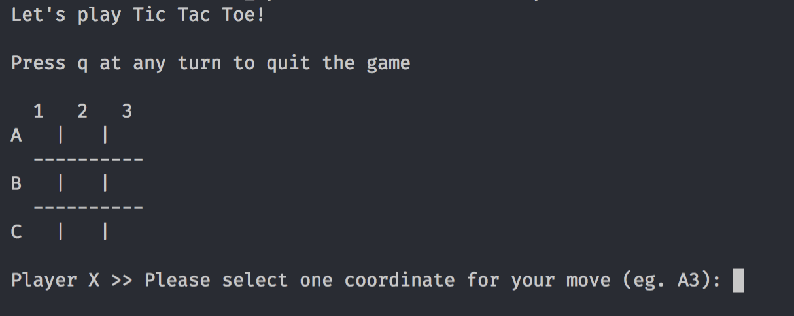

# Tic Tac Toe
## Description
The classic childhood game, Tic Tac Toe built with Ruby to be played in Terminal.

Below displays how the game will begin:

## How it works
1. Open the game in Terminal
2. To initiate the Colorize gem, enter 'bundle' in your Terminal
3. To begin, player X will start the game when prompted
4. Player O will then take their turn
5. The game will continue until there is a win, a draw or a player quits the game

## Assumptions and Restrictions
- This application only allows for two players, with which player one will always be "X" and player two will always be "O"
- Assumption that only one game will be played, the game will have to be restarted if the players would like to play again
- At each players turn the application will check if there is a winner, if I was to build a larger functioning Tic Tac Toe game, I would only input this method after player one's third turn

## Challenges
The hardest challenge faced whilst building this Tic Tac Toe application, was the checking for availability method. At first, I was able to create a method which could calculate that the selected move was already taken, however, it would then override the player's token who was in that position first. 
This challenge was overcome through sectioning off more code and creating more methods.

Another challenge was based around the multiple loops neccessary to have a functioning Tic Tac Toe game. After hoping to use the .each method more often, I realised my code was much cleaner and easier to follow by again, creating more concise methods.